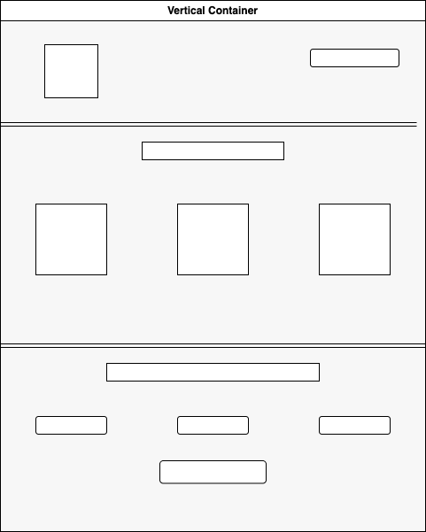

# Proyecto 3: Landing de Negocio

Este proyecto p# Página de Aterrizaje - [Agencia de Viajes]

## Descripción

Esta página de aterrizaje está diseñada para proporcionar a los usuarios una visión clara y atractiva sobre nuestro negocio y los productos/servicios que ofrecemos. Al acceder, los visitantes podrán explorar la interfaz y comprender rápidamente la propuesta de valor.

## Características

- Interfaz intuitiva: Diseño limpio y fácil de navegar.
- Información relevante: Explicación clara del negocio y sus productos.
- Optimización: Adaptabilidad para distintos dispositivos y rapidez de carga.

## Tecnologías utilizadas

- HTML5, CSS
- Frameworks/Librerías: Bootstrap
- Herramientas adicionales: https://app.diagrams.net/

## Prototipo

